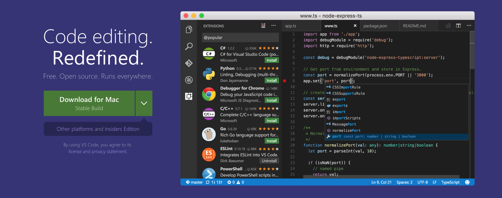
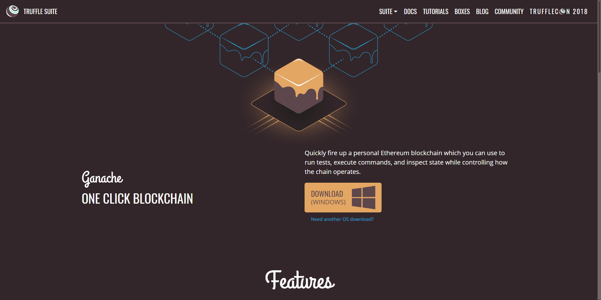
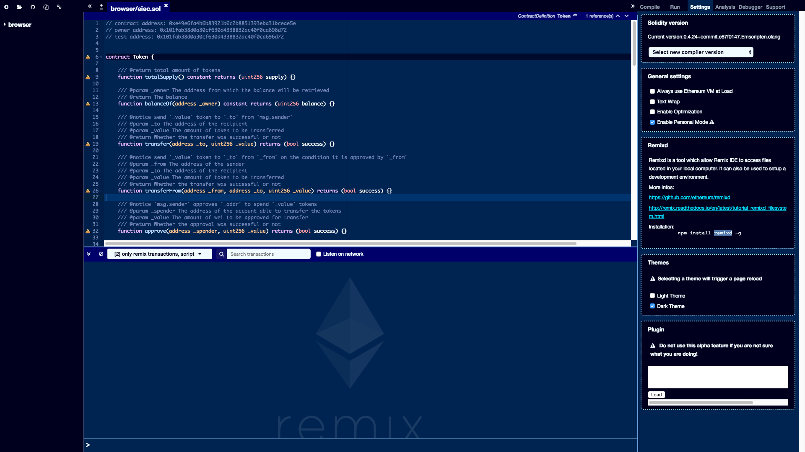

# 第一章　調教你的電腦

好的，相信妳點近來就已經作好透過學習區塊鏈變美的覺悟了，在這之前，我習慣直接講重點，甚麼硬分岔，開高叉，還是君士坦丁堡或甚麼大亨堡的，這些太傷身且卡路里太高，不在我們學習範圍，我們直接切入軟體開始我們的區塊鏈變美之旅吧꒰✩’ω\`ૢ✩꒱


以下為我建議下載安裝的軟體，可以各自到官網下載，或是懶人省點時間敷個面膜，可以下載我的整合包。


## [區塊鏈開發軟體架設變美包.zip](https://drive.google.com/file/d/1I2E60keyz4wiZRgLkSZ5uO0YHzU0PDaz/view?usp=sharing)

這份變美清單包含\(安裝順序也建議這樣\)：

1. **Node.js**   \(npm，npm是?變美用的\)
2. **Git-2.18.0**   \(省下妳少按一個$符號突增末梢神經發炎的機率\)
3. **Microsoft Visual Code** \(用筆記開發很low很土，這是iphone level的筆記本\)
4. **Geth -windows版** \(以太坊提供的官方...啥的，下載有保庇\)
5. **ganache** 很甜看起來很好吃，可以在妳但電腦裡模擬出區塊鏈，為啥要在電腦裡模擬阿? 難到妳要那麼快讓人看到妳美到驚人的智能合約嗎?

其他在安裝包裡但尚未列出的，在該章節寫到前用不上，可以先存在妳的電腦裡，  
若妳太潮用Mac甚至Ubuntu，那麼請等我有空哪天沒那麼想睡會補足下載點，  
或自己先去找谷姊



Node.js引用自wiki百科：

> **Node.js**是一個能夠在伺服器端運行[JavaScript](https://zh.wikipedia.org/wiki/JavaScript)的[開放原始碼](https://zh.wikipedia.org/wiki/%E9%96%8B%E6%94%BE%E5%8E%9F%E5%A7%8B%E7%A2%BC)、[跨平台](https://zh.wikipedia.org/wiki/%E8%B7%A8%E5%B9%B3%E5%8F%B0)JavaScript [執行環境](https://zh.wikipedia.org/wiki/%E6%89%A7%E8%A1%8C%E7%8E%AF%E5%A2%83)。Node.js由Node.js基金會持有和維護[\[3\]](https://zh.wikipedia.org/wiki/Node.js#cite_note-3)，並與[Linux基金會](https://zh.wikipedia.org/wiki/Linux%E5%9F%BA%E9%87%91%E6%9C%83)有合作關係[\[4\]](https://zh.wikipedia.org/wiki/Node.js#cite_note-4)。Node.js採用[Google](https://zh.wikipedia.org/wiki/Google)開發的[V8](https://zh.wikipedia.org/wiki/V8_%28JavaScript%E5%BC%95%E6%93%8E%29)執行程式碼，使用[事件驅動](https://zh.wikipedia.org/wiki/%E4%BA%8B%E4%BB%B6%E9%A9%85%E5%8B%95)、[非阻塞](https://zh.wikipedia.org/w/index.php?title=%E9%9D%9E%E9%98%BB%E5%A1%9E&action=edit&redlink=1)和 [非同步輸入輸出](https://zh.wikipedia.org/w/index.php?title=%E9%9D%9E%E5%90%8C%E6%AD%A5%E8%BC%B8%E5%85%A5%E8%BC%B8%E5%87%BA&action=edit&redlink=1)模型等技術來提高效能，可優化應用程式的傳輸量和規模。這些技術通常用於資料密集的實時應用程式。
>
> Node.js大部分基本模組都用JavaScript語言編寫。在Node.js出現之前，JavaScript通常作為用戶端程式設計語言使用，以JavaScript寫出的程式常在用戶的瀏覽器上執行。Node.js的出現使JavaScript也能用於伺服器端編程。Node.js含有一系列內置模組，使得程式可以脫離[Apache HTTP Server](https://zh.wikipedia.org/wiki/Apache_HTTP_Server)或[IIS](https://zh.wikipedia.org/wiki/IIS)，作為獨立伺服器執行。

說成人話，就是一個大補帖。



> **git**（/ɡɪt/， 音訊 說明·資訊）是一個分散式版本控制軟體，最初由林納斯·托瓦茲創作，於2005年以GPL釋出。 最初目的是為更好地管理Linux內核開發而設計。 應注意的是，這與GNU Interactive Tools（一個類似Norton Commander介面的檔案管理器）有所不同。

可以減少妳手指末梢神經發炎的好物。

{% embed data="{\"url\":\"https://code.visualstudio.com/download\",\"type\":\"link\",\"title\":\"Download Visual Studio Code - Mac, Linux, Windows\",\"description\":\"Visual Studio Code is free and available on your favorite platform - Linux, macOS, and Windows.  Download Visual Studio Code to experience a redefined code editor,  optimized for building and debugging modern web and cloud applications.\",\"icon\":{\"type\":\"icon\",\"url\":\"https://code.visualstudio.com/favicon.ico\",\"width\":128,\"height\":128,\"aspectRatio\":1},\"thumbnail\":{\"type\":\"thumbnail\",\"url\":\"https://code.visualstudio.com/opengraphimg/opengraph-home.png\",\"width\":1223,\"height\":630,\"aspectRatio\":0.5151267375306623}}" %}

挺潮的記是本不是嗎?

{% embed data="{\"url\":\"https://truffleframework.com/ganache\",\"type\":\"link\",\"title\":\"Truffle Suite \| Ganache\",\"description\":\"The Truffle suite of tools make dapp development easier and more consistent.\",\"icon\":{\"type\":\"icon\",\"url\":\"https://truffleframework.com/img/favicons/chrome-touch-icon-192x192.png\",\"width\":192,\"height\":192,\"aspectRatio\":1},\"thumbnail\":{\"type\":\"thumbnail\",\"url\":\"https://truffleframework.com/img/favicons/truffle-share.png\",\"width\":1200,\"height\":1200,\"aspectRatio\":1}}" %}

Ganache 電腦本機區塊鏈模擬器，儘管不確定會不會用它，至少看起來好吃；甜甜的

## 好了，我反而先從以太坊現上編輯器Remix的使用開始

啥?那為什麼要教你先裝?  
當然什麼都要熱身阿!^（｀ω´ ）^ψ

Remix是以太坊官方推薦使用的IDE\(潮\)，在Remix上我們可以進行合約的編寫，並且還可以對以太坊環境進行整合，進行智慧合約的部署與除錯。

Remix有Web版本和Electron APP兩個版本：

* Web： [http://remix.ethereum.org/](https://tw.saowen.com/rd/aHR0cDovL3JlbWl4LmV0aGVyZXVtLm9yZy8=)
* Electron APP： [https://github.com/horizon-games/remix-app](https://tw.saowen.com/rd/aHR0cHM6Ly9naXRodWIuY29tL2hvcml6b24tZ2FtZXMvcmVtaXgtYXBw)

你可以選擇Web版或者Electron版本，它們的功能沒有任何差別；或一樣沒用。  
下一章節，我們就來探訪這神奇的小Re吧!

