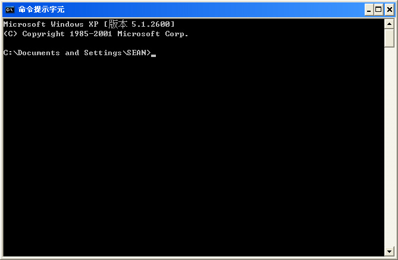

# Remix的使用

### **安裝Remixd服務**

 由於Remix提供的是一個線上的Web環境，因此在本地不會儲存你所編寫的智慧合約源文件，如果你希望文件能一直儲存在本地，就像把你男友死死的鎖旁邊，那你可以安裝Remixd服務。

找到你的命令提示字元  ，對就是下面看到會頭暈，眼角魚尾紋會冒出來的這個。



```
$ give me super-powers
```

 **啟動remixd\(複製到底就對了\)：**


```text
# 使用絕對路徑
remixd -s /Users/username/path_you_store_contracts
```



待續....喜歡歡迎斗內





